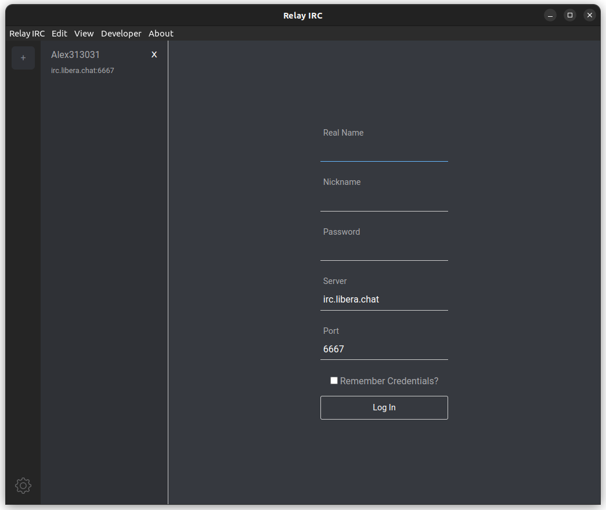

# Relay IRC

- 🆓 **Free and Open-Source**
- ✉️ **Multiple Connections**
- 🤔 **Remember Past Credentials**
- 👋 **Automatically Join Channels After Connecting**
- 🔔 **Desktop Notifications**
- 👔 **Clean Interface**
- 😈 **Dark Mode**

## Installation

Download releases for Linux and Windows [here](https://github.com/Alex313031/Relay-IRC/releases)  

For other platforms, you'll have to [build your own](#Building).

## Screenshot


## Building

```shell
$ npm install
$ npm run start
```

 - To start this thing with react/redux devtools:

```shell
$ npm run dev
```

To lint, check types, and run tests:

```shell
$ npm run test
```

While writing code, you might want to watch things:

```shell
# run tests when code changes
$ npm run jest -- --watch

# check types when code changes
$ npm run flow -- --watch
```

To build an executable installer for your OS:

```shell
$ npm run dist
```
